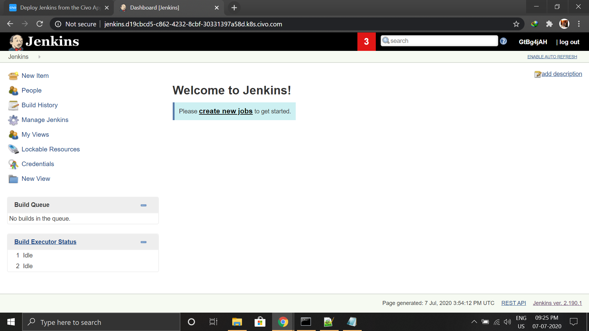
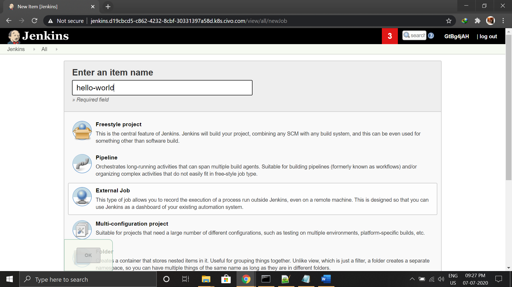
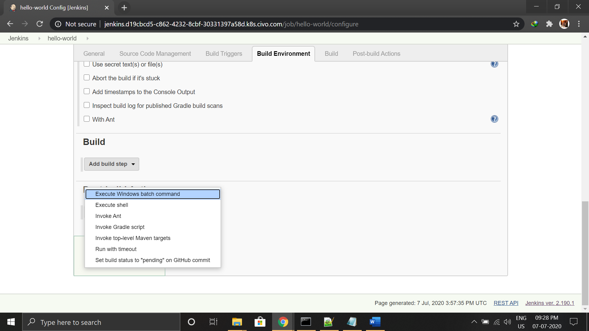
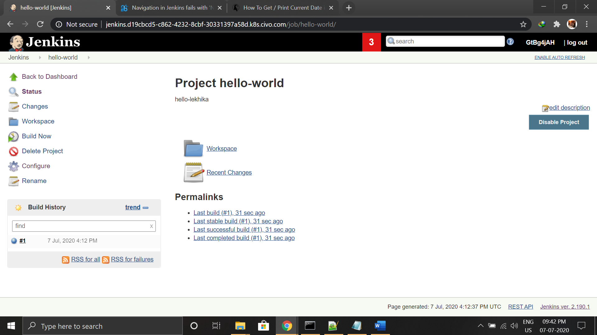
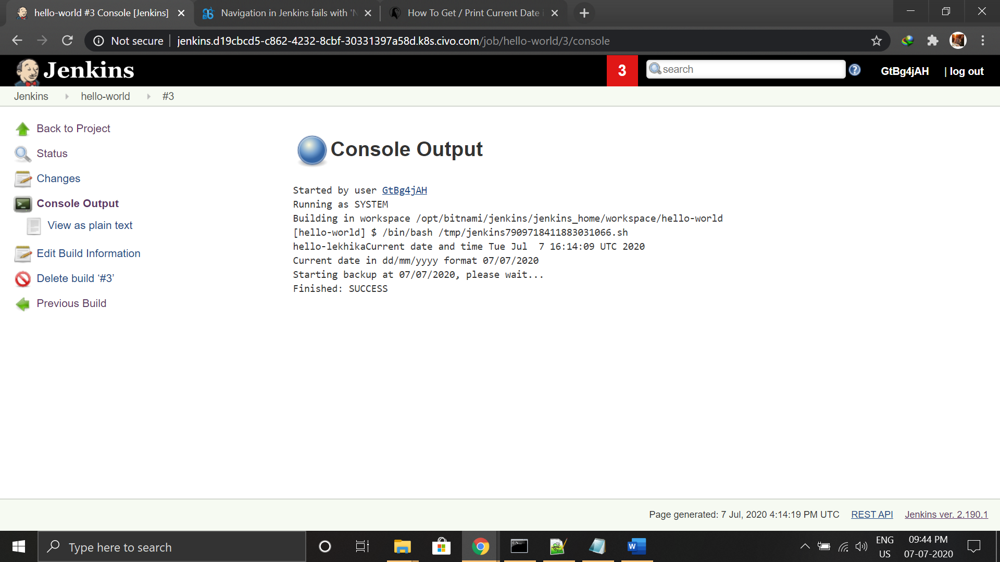

# jenkins-on-civo
 
# Introduction
Jenkins is a open-source automation server, which enables building, testing, and deploying, facilitating continuous integration and continuous delivery and offers over 1600 plugins to automate almost everything.

# Prerequisites
If you would like to follow along in this guide, you need a Civo account and also require Kubernetes access. At the time of writing, Civo's Kubernetes offering is currently in Beta

# Deploy a Kubernetes Cluster
Here i have used the civo cli.

# Civo Command-Line Client
# Introduction
Civo CLI is a tool to manage your Civo.com account from the terminal. The Civo web control panel has a user-friendly interface for managing your account, but in case you want to automate or run scripts on your account, or have multiple complex services, the command-line interface outlined here will be useful. This guide will cover the set-up and usage of the Civo CLI tool with examples.

STATUS: This project is currently under active development and maintenance.

# Set-up
Civo CLI is built with Go and distributed as binary files, available for multiple operating systems and downloadable from https://github.com/civo/cli/releases.

# API Keys
For accessing the civo ,you need to provide a api key by creating n get that api key.

# Introduction
In order to use the command-line tool, you will need to authenticate yourself to the Civo API using a special key. You can find an automatically-generated API key or regenerate a new key at https://www.civo.com/api.

Adding a current API Key to your account
You can add the API Key to the CLI tool through the API Keys command. civo apikey add apikey_name apikey such as:

    C:\WINDOWS\system32>civo kubernetes create my-first-cluster
    Error: Creating the connection to Civo's API failed with no API Key supplied, this is required

    C:\WINDOWS\system32>civo apikey add Demo_Test_Key *************************************************
    Saved the API Key ←[32mDemo_Test_Key←[0m as ←[32m*****************************************←[0m

    C:\WINDOWS\system32>civo apikey current Demo_Test_Key
    Set the default API Key to be ←[32mDemo_Test_Key←[0m

    C:\WINDOWS\system32>civo apikey list
    +---------------+----------------------------------------------------+---------+
    | Name          | Key                                                | Default |
    +---------------+----------------------------------------------------+---------+
    | Demo_Test_Key | ********************************************** | <=====  |
    +---------------+----------------------------------------------------+---------+

# Kubernetes clusters
# Create a cluster
You can create a cluster by running civo kubernetes create with a cluster name parameter, as well as any options you provide:

size - The size of nodes to create, from the current list of sizes available at civo sizes. Defaults to g2.medium.

nodes - The number of nodes to create (the master also acts as a node).
version - the k3s version to use on the cluster. Defaults to the latest.
    
wait - a simple flag (e.g. --wait) that will cause the CLI to spin and wait for the cluster to be ACTIVE.
     
     $ civo kubernetes create my-first-cluster
     Created Kubernetes cluster my-first-cluster

# Kubernetes Applications
# Introduction
You can install applications from the Applications Marketplace through the command-line interface. The installation depends on whether you are creating a new cluster or adding applications to an existing cluster.

# Listing Available Applications
To get an up-to-date list of available applications on the Marketplace, run civo kubernetes apps list. At the time of writing, the list looked like this:

    +----------------------+-------------+--------------+-----------------+--------------+
    | Name                 | Version     | Category     | Plans           | Dependencies |
    +----------------------+-------------+--------------+-----------------+--------------+
    | cert-manager         | v0.11.0     | architecture |                 | Helm         |
    | Helm                 | 2.16.5      | management   |                 |              |
    | Jenkins              | 2.190.1     | ci_cd        | 5GB, 10GB, 20GB | Longhorn     |
    | KubeDB               | v0.12.0     | database     |                 | Longhorn     |
    | Kubeless             | 1.0.5       | architecture |                 |              |
    | kubernetes-dashboard | v2.0.0      | management   |                 |              |
    | Linkerd              | 2.5.0       | architecture |                 |              |
    | Longhorn             | 0.7.0       | storage      |                 |              |
    | Maesh                | Latest      | architecture |                 | Helm         |
    | MariaDB              | 10.4.7      | database     | 5GB, 10GB, 20GB | Longhorn     |
    | metrics-server       | (default)   | architecture |                 |              |
    | MinIO                | 2019-08-29  | storage      | 5GB, 10GB, 20GB | Longhorn     |
    | MongoDB              | 4.2.0       | database     | 5GB, 10GB, 20GB | Longhorn     |
    | OpenFaaS             | 0.18.0      | architecture |                 | Helm         |
    | Portainer            | beta        | management   |                 |              |
    | PostgreSQL           |        11.5 | database     | 5GB, 10GB, 20GB | Longhorn     |
    | prometheus-operator  | 0.35.0      | monitoring   |                 |              |
    | Rancher              | v2.3.0      | management   |                 |              |
    | Redis                |         3.2 | database     |                 |              |
    | Selenium             | 3.141.59-r1 | ci_cd        |                 |              |
    | Traefik              | (default)   | architecture |                 |              |
    +----------------------+-------------+--------------+-----------------+-

    C:\WINDOWS\system32>civo kubernetes create my-first-cluster
    The cluster ←[32mmy-first-cluster←[0m (d19cbcd5-c862-4232-8cbf-30331397a58d) has been created

    C:\WINDOWS\system32>civo kubernetes list
    +--------------------------------------+------------------+------+-----------+-----------------+
    | ID                                   | Name             | Node | Size      | Status          |
    +--------------------------------------+------------------+------+-----------+-----------------+
    | d19cbcd5-c862-4232-8cbf-30331397a58d | my-first-cluster |    3 | g2.medium | ←[34mINSTANCE-CREATE←[0m |
    +--------------------------------------+------------------+------+-----------+-----------------+
    Because Jenkins requires persistent volumes, we require Longhorn.

    C:\WINDOWS\system32>kubectl get node
    NAME               STATUS   ROLES    AGE     VERSION
    kube-node-5a93     Ready    <none>   105s    v1.16.3-k3s.2
    kube-master-8549   Ready    master   3m1s    v1.16.3-k3s.2
    C:\WINDOWS\system32>civo kubernetes applications add Longhorn --cluster=my-first-cluster
    The application was installed in the Kubernetes cluster ←[32mmy-first-cluster←[0m

    C:\WINDOWS\system32>civo kubernetes applications add Longhorn --cluster=my-first-cluster
    The application was installed in the Kubernetes cluster ←[32mmy-first-cluster←[0m
    C:\WINDOWS\system32>civo kubernetes show my-first-cluster
              ID : d19cbcd5-c862-4232-8cbf-30331397a58d
            Name : my-first-cluster
           Nodes : 3
            Size : g2.medium
          Status : ACTIVE
         Version : 1.0.0
    API Endpoint : https://91.211.153.101:6443
       Master IP : 91.211.153.101
    DNS A record : d19cbcd5-c862-4232-8cbf-30331397a58d.k8s.civo.com

    Nodes:
    +------------------+----------------+--------+-----------+
    | Name             | IP             | Status | Size      |
    +------------------+----------------+--------+-----------+
    | kube-master-8549 | 91.211.153.101 | ACTIVE | g2.medium |
    | kube-node-5a93   |                | ACTIVE | g2.medium |
    | kube-node-bb4e   |                | ACTIVE | g2.medium |
    +------------------+----------------+--------+-----------+

    Applications:
    +----------------+-----------+-----------+--------------+
    | Name           | Version   | Installed | Category     |
    +----------------+-----------+-----------+--------------+
    | Longhorn       | 0.7.0     | true      | storage      |
    | metrics-server | (default) | true      | architecture |
    | Traefik        | (default) | true      | architecture |
    +----------------+-----------+-----------+--------------+
    
# DNS NAME:
It is useful to provide a DNS to your instances and pods in kubernetes ,so that you can easily reach to them.

    C:\WINDOWS\system32>civo domain record create lekhika.civo.com -n www -t 600 -e a -v 91.211.153.101
    Created ←[32ma←[0m record ←[32mwww←[0m for ←[32mlekhika.civo.com←[0m with a TTL of ←[32m600←[0m seconds and with a priority of ←[32m0←[0m with ID ←[32mee0cf523-3f13-46d2-     a868-98fe306a3a59←[0m
    C:\WINDOWS\system32>civo domain record list civo.com
    +--------------------------------------+------+----------------+------+-----+----------+
    | ID                                   | Name | Value          | Type | TTL | Priority |
    +--------------------------------------+------+----------------+------+-----+----------+
    | ee0cf523-3f13-46d2-a868-98fe306a3a59 | www  | 91.211.153.101 | a    | 600 |        0 |
    +--------------------------------------+------+----------------+------+-----+----------+
    C:\WINDOWS\system32>civo region ls
    +------+----------+---------+
    | Code | Name     | Default |
    +------+----------+---------+
    | lon1 | London 1 | <=====  |
    +------+----------+---------+

You can also rename your cluster using:

    C:\WINDOWS\system32>civo kubernetes rename my-first-cluster --name="lekhikatest"
    The kubernetes cluster was rename to ←[32mlekhikatest←[0m with ID ←[32md19cbcd5-c862-4232-8cbf-30331397a58d←[0m

# SSH Keys
# Introduction
To manage the SSH keys for an account that are used to log in to cloud instances, the Civo CLI tool provides the following commands. You would need to generate a new key according to your particular circumstances, if you do not have a suitable SSH key yet.

You can use puttygen and save your public key.The browse to it.

    C:\Users\user\Desktop>civo ssh create lekhika --key civo
    Created an SSH key called ←[32mlekhika←[0m with ID ←[32mc294e8c2-206f-4675-aba2-b3705895e40e←[0m

    C:\Users\user\Desktop>civo ssh list
    +--------------------------------------+---------+--------------+
    | ID                                   | Name    | Finger Print |
    +--------------------------------------+---------+--------------+
    | c294e8c2-206f-4675-aba2-b3705895e40e | lekhika |              |
    +--------------------------------------+---------+--------------+

# Templates
# Introduction
Civo instances are built from a template that specifies a disk image. Templates can contain the bare-bones OS install such as Ubuntu or Debian, or custom pre-configured operating systems that you can create yourself from a bootable volume. This allows you to speedily deploy pre-configured instances.

     C:\Users\user\Desktop>civo template list+--------------------------------------+----------------+----------------+--------------------------------------+----------------------------------------------------+-------------+------------------+| ID                                   | Code           | Name           | Image ID                             | Short Description                                  | Description | Default Username |+--------------------------------------+----------------+----------------+--------------------------------------+----------------------------------------------------+-------------+------------------+| 458ae900-30e0-4ade-bd68-d137d57d4e47 | centos-7       | CentOS 7       | e17ec38a-1e77-4c45-bef3-569567c9b169 | CentOS 7 - aiming to be compatible with RHEL 7     |             | centos           || 033c35a0-a8c3-4518-8114-d156a4d4c512 | debian-stretch | Debian Stretch | 2ffff07e-6953-4864-8ce9-1f754d70de31 | Debian v9 (Stretch), current stable Debian release |             | admin            || b0d30599-898a-4072-86a1-6ed2965320d9 | ubuntu-16.04   | Ubuntu 16.04   | 8b4d81e0-6283-4ea3-bbc4-478df568024e | Ubuntu 16.04                                       |             | ubuntu           || 811a8dfb-8202-49ad-b1ef-1e6320b20497 | ubuntu-18.04   | Ubuntu 18.04   | e4838e89-f086-41a1-86b2-60bc4b0a259e | Ubuntu 18.04                                       |             | ubuntu           || fffbe2e5-0dd8-476b-b480-cb7c9fccbe39 | debian-buster  | Debian Buster  | 38686161-ba25-4899-ac0a-54eaf35239c0 | Debian v10 (Buster), latest stable Debian release  |             | admin            |+--------------------------------------+----------------+----------------+--------------------------------------+----------------------------------------------------+-------------+------------------+

Then install jenkins on the cluster ,select your plan.

     C:\Users\user\Desktop>civo kubernetes applications add Jenkins:5GB  --cluster=lekhikatest
     The application was installed in the Kubernetes cluster ←[32mlekhikatest←[0m

Set your DNS name and application name if you would like to access Jenkins as jenkins.{your-id}.k8s.civo.com:

     C:\Users\user\Desktop>set CIVO_DNS=d19cbcd5-c862-4232-8cbf-30331397a58d.k8s.civo.com

     C:\Users\user\Desktop>set CIVO_APP=jenkins

Now,create a ingress file named as jenkins-ingress.yaml to configure your jenkins.You can copy and pase the file content from the cli of civo in istalled apps section

     C:\Users\user\Desktop>kubectl apply -f jenkins-ingress.yaml
     ingress.extensions/jenkins-ingress created

     C:\Users\user\Desktop>kubectl get ingress
     NAME              HOSTS                                                       ADDRESS          PORTS   AGE
     jenkins-ingress   jenkins.d19cbcd5-c862-4232-8cbf-30331397a58d.k8s.civo.com   91.211.153.101   80      83s

# Access Jenkins
Now that Jenkins has been deployed, visit the address that was received from the ingress output:

You can retrieve the username and password from the Civo Dashboard under "Installed applications":

To get started, let's create a traditional hello-world job, which in this case is a shell script that outputs the time:

From the build section, select the execute shell option:

Then we will execute a very basic shell script that returns the date.After saving the job, select build now:

Then from the build, view the console output:

# Testing Data Persistence
As we know, containers are stateless by design. If we did not have persistent volumes associated to our container, were we to delete the container, our saved job in Jenkins will be missing when the container comes back up.

But since we are using persistent volumes, the configured data is persisted in our volumes and when the container is deleted, the new container will still have the saved data that was stored on the volumes.

In this example, we will delete the pod to determine if the data is still there when the new pod comes up.

View the pods with the wide output flag so that we can see on which node the pod is running:

    C:\Users\user\Desktop>kubectl get pods --selector app=jenkins --output wide
    NAME                      READY   STATUS    RESTARTS   AGE   IP             NODE               NOMINATED NODE   READINESS GATES
    jenkins-d9b46dc78-kr2zs   1/1     Running   0          41m  
     192.168.0.14   kube-master-8549   <none>           <none>

Now delete the pod by specifying the pod id returned in the above command:

    C:\Users\user\Desktop>kubectl delete pod/jenkins-d9b46dc78-kr2zs
    pod "jenkins-d9b46dc78-kr2zs" deleted

Then once the pod comes back up, we can view the pod again and notice in this case that the pod runs on a different node on our kubernetes cluster:

    C:\Users\user\Desktop>kubectl get pods --selector app=jenkins --output wide
    NAME                      READY   STATUS              RESTARTS   AGE   IP       NODE             NOMINATED NODE   READINESS GATES
    jenkins-d9b46dc78-jtjhj   0/1     ContainerCreating   0          19s   <none>   kube-node-bb4e   <none>           <none>

    C:\Users\user\Desktop>kubectl get pods --selector app=jenkins --output wide
    NAME                      READY   STATUS              RESTARTS   AGE   IP       NODE             NOMINATED NODE   READINESS GATES
    jenkins-d9b46dc78-jtjhj   0/1     ContainerCreating   0          29s   <none>   kube-node-bb4e   <none>           <none>

    C:\Users\user\Desktop>kubectl get pods --selector app=jenkins --output wide
    NAME                      READY   STATUS    RESTARTS   AGE   IP             NODE             NOMINATED NODE   READINESS GATES
    jenkins-d9b46dc78-jtjhj   1/1     Running   0          55s   192.168.1.12   kube-node-bb4e   <none>           <none>

Once you are done, you can go ahead and delete your cluster, or use the setup you have to continue to experiment with automation. If you have a project with a test suite, you can have Jenkins run the tests and rebuild your containers, as well as push the container(s) to a registry for access by others!

# Conclusion
Civo really makes it easy provisioning Kubernetes clusters and Deploying applications such as Jenkins to your Cluster. Have a look at all the other applications that are available on the marketplace - or if you think it's missing one, submit it for the benefit of the community! The marketplace is open-source.
